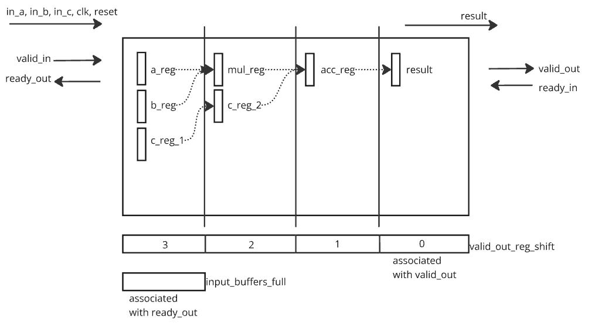

# Pipelined Adder

This is a 4-stage pipelined **Multiply-and-Add** module designed with **ready-valid handshaking** for reliable data processing.

## Overview
The module performs `result = (in_a * in_b) + in_c` in a pipelined manner over **four stages**:

1. **Register Inputs:** Capture `in_a`, `in_b`, and `in_c`.
2. **Multiplication:** Compute `in_a * in_b`.
3. **Addition:** Add stored `c` value from the previous cycle.
4. **Output Stage:** Provide the final result.

---

## Block Diagram
  

## Results  (log_output.txt)
 

the full behaviour of the pipeline is shown here 
1. without waitng for `ready_out` external module will drive inputs and data will be missed 
2. reset at the middle of the data sequence

## Improvements
1. add a predictor look at the 4th previous input and predict the output in the cocotb test bench
2. drive random inputs

---

## I/O Signals

| Signal      | Width  | Direction | Description |
|-------------|--------|-----------|-------------|
| `clk`       | 1-bit  | Input     | Clock signal |
| `reset`     | 1-bit  | Input     | Active-high reset |
| `in_a`      | 8-bit  | Input     | Multiplier operand |
| `in_b`      | 8-bit  | Input     | Multiplier operand |
| `in_c`      | 16-bit | Input     | Additive operand |
| `valid_in`  | 1-bit  | Input     | Input valid flag |
| `ready_out` | 1-bit  | Output    | Ready to accept new data |
| `result`    | 16-bit | Output    | Computed output `(a * b) + c` |
| `valid_out` | 1-bit  | Output    | Output valid flag |
| `ready_in`  | 1-bit  | Input     | Downstream ready signal |

---

