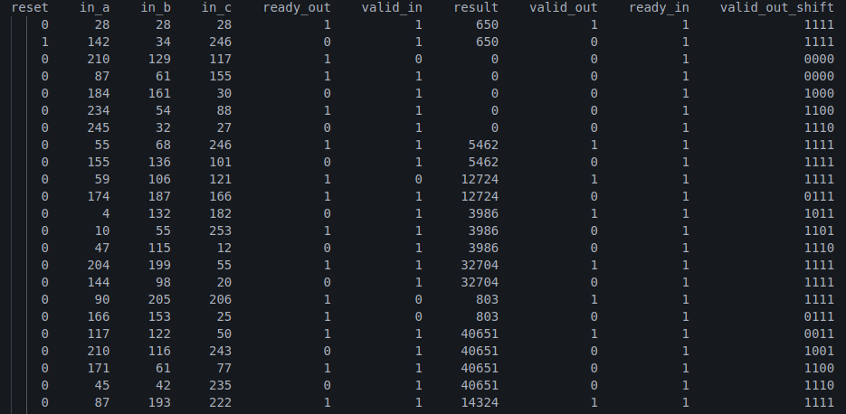

# Pipelined Multiply and Accumulator

This is a 4-stage pipelined **Multiply-and-Add** module designed with **ready-valid handshaking** for reliable data processing.

## Overview
The module performs `result = (in_a * in_b) + in_c` in a pipelined manner over **four stages**:

1. **Register Inputs:** Capture `in_a`, `in_b`, and `in_c`.
2. **Multiplication:** Compute `in_a * in_b`.
3. **Addition:** Add stored `c` value from the previous cycle.
4. **Output Stage:** Provide the final result.

---

## Block Diagram
  

## Results  (log_output.txt)
 

the full behaviour of the pipeline is shown here 

---
## 2 tests are are done to verify the functionality
1. log all the data in clock edges
2. compare values expected vs calculated

---
# Note
1. In the test bench `ready_in` is always driven high 
2. In test1 `valid_in` is always 1 and in test2 `valid_in` is 80% of the time is 1 because test bench provide data that are valid without looking at the `ready_out`, some input signals are missed by the DUT and output is duplicated